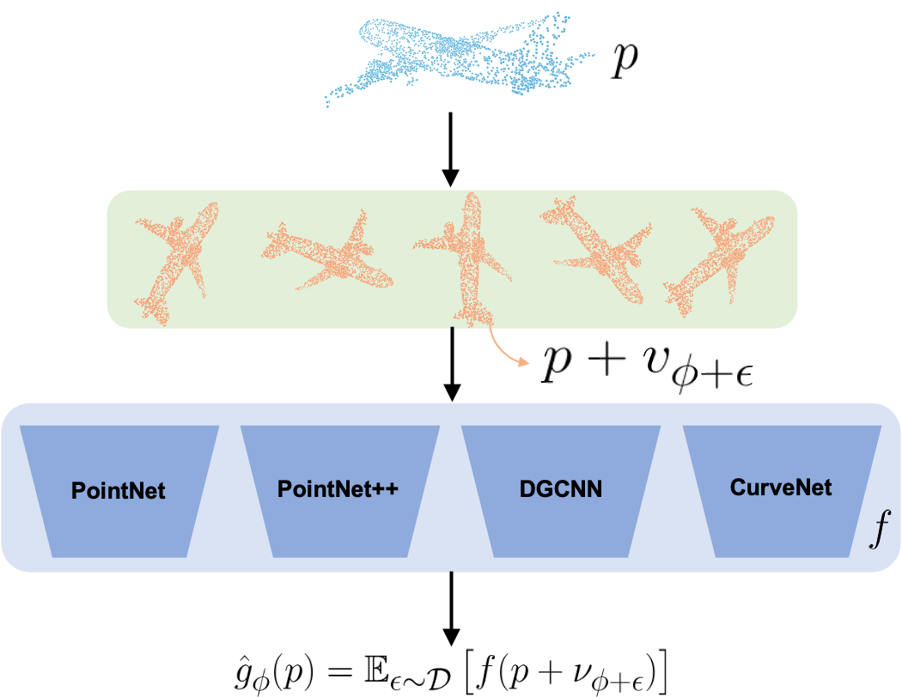

# 3DeformRS
Official implementation of "3DeformRS: Certifying Spatial Deformations on Point Clouds",
Research done as VSRP in King Abullah's University of Science and Technology by Gabriel Pérez S



## Requirements (tested on)
- Python = 3.8
- PyTorch = 1.9 , cuda = 11.1
- Pytorch-geometric = 1.7
- scipy = 1.7

## Data

two major datasets were used, ModelNet40 and ScanObjectNN


### ModelNet40
At your first run, any of the training programs will automatically download the corresponding version of ModelNet40 unless already there. Implementation-wise, there are 3 "different" versions on the dataset. 


#### CurveNet
Uses the ply_hdf5_2048 version which can be manually downloaded from [offical data](https://shapenet.cs.stanford.edu/media/modelnet40_ply_hdf5_2048.zip) and then unzipped directly under the Data folder.

#### PointNet
Downloads the torch geometric version of the dataset, however, uses hand-made pre-transforms which make it incompatible with the vanilla torch geometric version of the dataset. namely, it applies transformers.SamplePoints(num=4096) transformers.FarthestPoints(num_points=1024). pre-transforms made by this implementation were kept in order to be consistent when comparing against [3D Certify](https://github.com/eth-sri/3dcertify)

#### PointNet++ and DGCNN
Both of these implementations are taken from the torch geometric examples and, because of this, uses the torch geometric integrated version of the dataset. 

### ScanObject
The ScanObject dataset can be obtained for reserach purposes following the correct process as stated in their public [page](https://hkust-vgd.github.io/scanobjectnn/). That is, writing an email to <mikacuy@gmail.com>, accepting terms of use and downloading. Once obtained please **unzip and place directly on the Data folder**. If you need this dataset in a different folder, flag --data_dir can be passed with the absolute path to it.


## Training and Testing

pre-trained models from us as well as original authors of the assessed DNN's can be found in the corresponding folder for every module:
* ```3D-RS-PointCloudCertifying/CurveNet/checkpoints/``` for CurveNet
* ```3D-RS-PointCloudCertifying/Pointnet/trainedModels``` for PointNet
* ```3D-RS-PointCloudCertifying/Pointnet2andDGCNN/trainedModels``` for PointNet++ and DGCNN

The following examples use ModelNet40, be aware that to use ScanObjectNN, value "scanobjectnn" must be passed instead of modelnet40 under the --dataset flag.

**NOTE:** all following commands assume the current working directory is ```3D-RS-PointCloudCertifying/``` when beggining.

### CurveNet

**Training**

```
cd CurveNet/core/
python3 main_cls.py --exp_name curvenetModelNet40BaseLine --dataset modelnet40 --epochs 100 --num_workers 10
```
**Testing**
```
python3 main_cls.py --eval True --exp_name cuvenetModelNet40BaseLine --dataset modelnet40 --num_workers 10 --model_path [your_own_path]/3D-RS-PointCloudCertifying/CurveNet/checkpoints/modelNet40BaseLine/models/model.t7
```

### PointNet

**Training**

```
cd Pointnet/
python3 train.py --experiment_name pointnetModelNet40BaseLine --dataset modelnet40 --epochs 100 --num_workers 10 --rotation none
```

**Testing**

```
python3 test.py --experiment_name pointnetModelNet40BaseLine --dataset modelnet40 --num_workers 10
```

### PointNet++

**Training**

```
cd Pointnet2andDGCNN/Trainers/
python3 pointnet2Train.py --experiment_name pointnet2ModelNet40Baseline --dataset modelnet40 --epochs 100
```

**Testing**

```
python3 pointnet2Test.py --experiment_name pointnet2ModelNet40Baseline --dataset modelnet40
```

### DGCNN

**Training**

```
cd Pointnet2andDGCNN/Trainers/
python3 dgcnnTrain.py --experiment_name dgcnnModelNet40Baseline --dataset modelnet40 --epochs 100
```

**Testing**

```
python3 dgcnnTest.py --experiment_name dgcnnModelNet40Baseline --dataset modelnet40
```

## Certify

After having trained a model, Certify.py can receive a path to the model, name of the network, in which dataset it was trained, the certified method or perturbation to be certified against, the sigma noise hyperparameter and the name of this experiment.

From this point on, the we will follow the user case of certifying a **Pointnet++ instance against rotations** and producing figures such as the ones in the paper. However, the idea is the same for any other network and deformation that one may need.

dataset_choices = ['modelnet40','modelnet10','scanobjectnn']
model_choices = ['pointnet2','dgcnn','curvenet','pointnet']
certification_method_choices = ['rotationX','rotationY','rotationZ','rotationXZ','rotationXYZ','translation','shearing','tapering','twisting','squeezing','stretching','gaussianNoise','affine','affineNoTranslation'] 